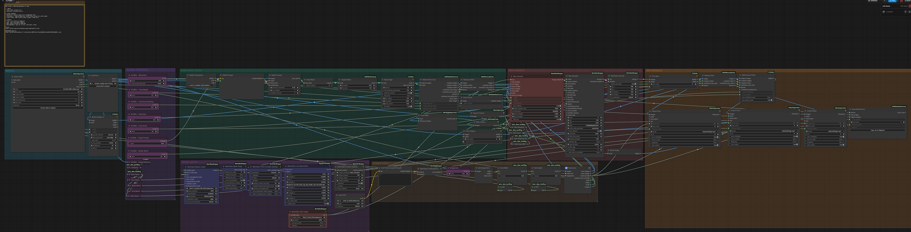
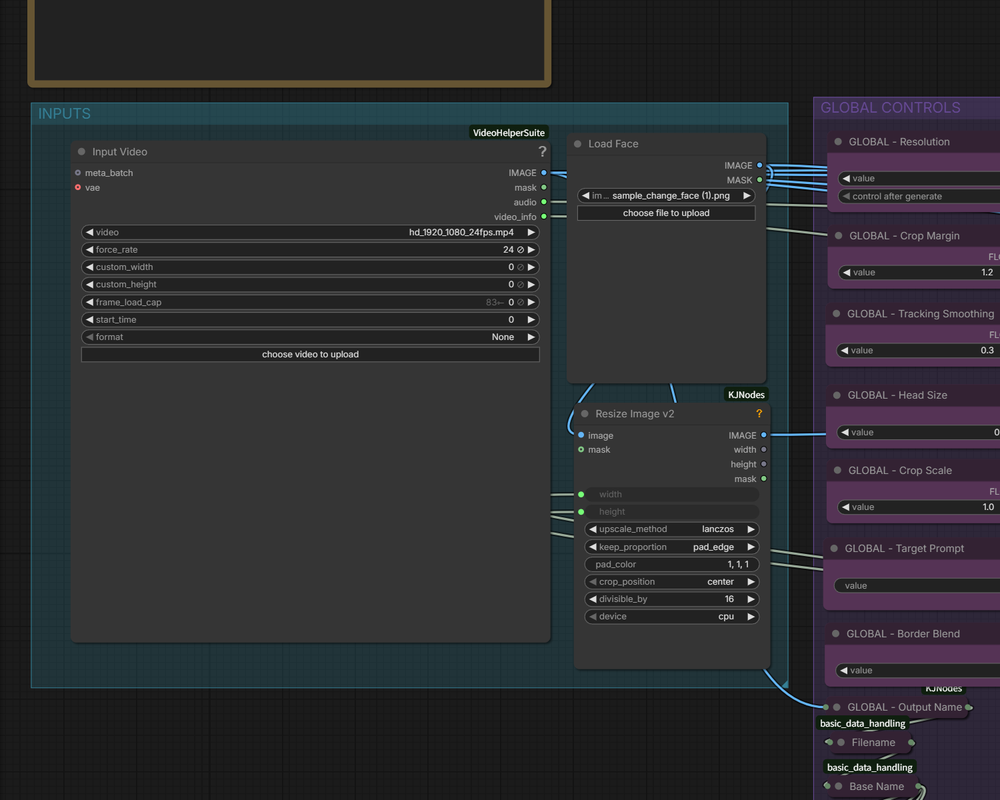
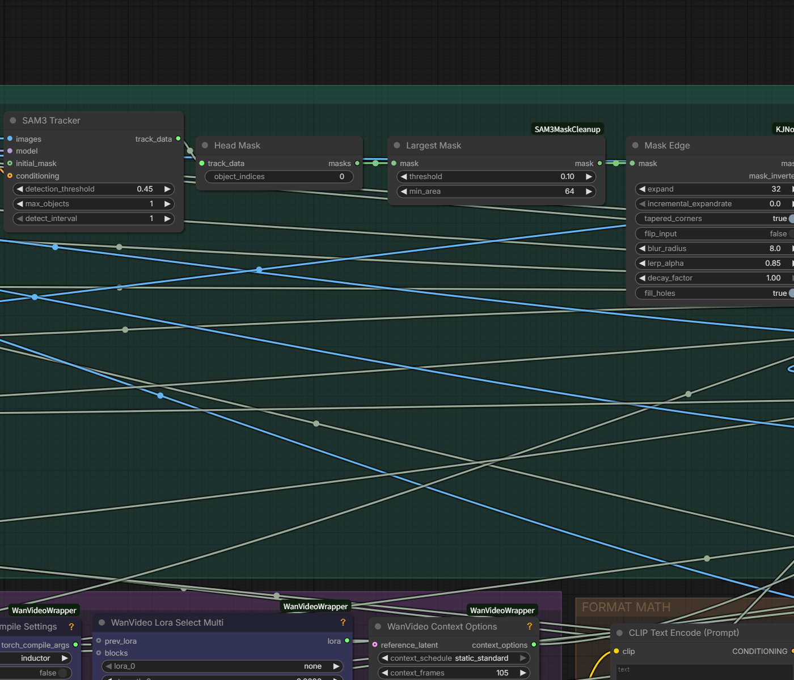
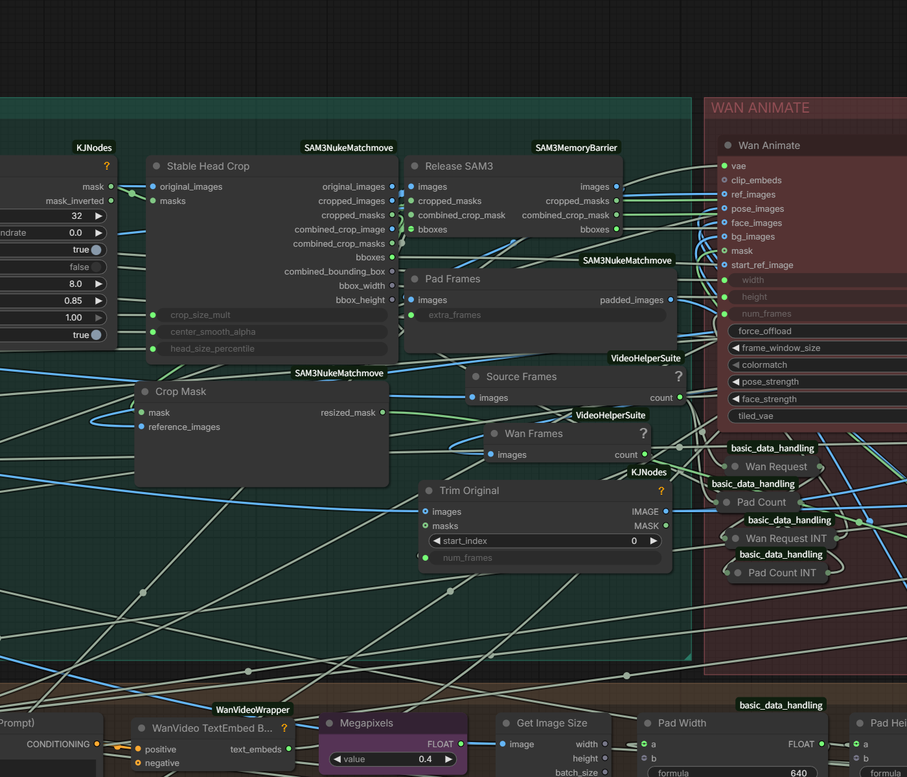
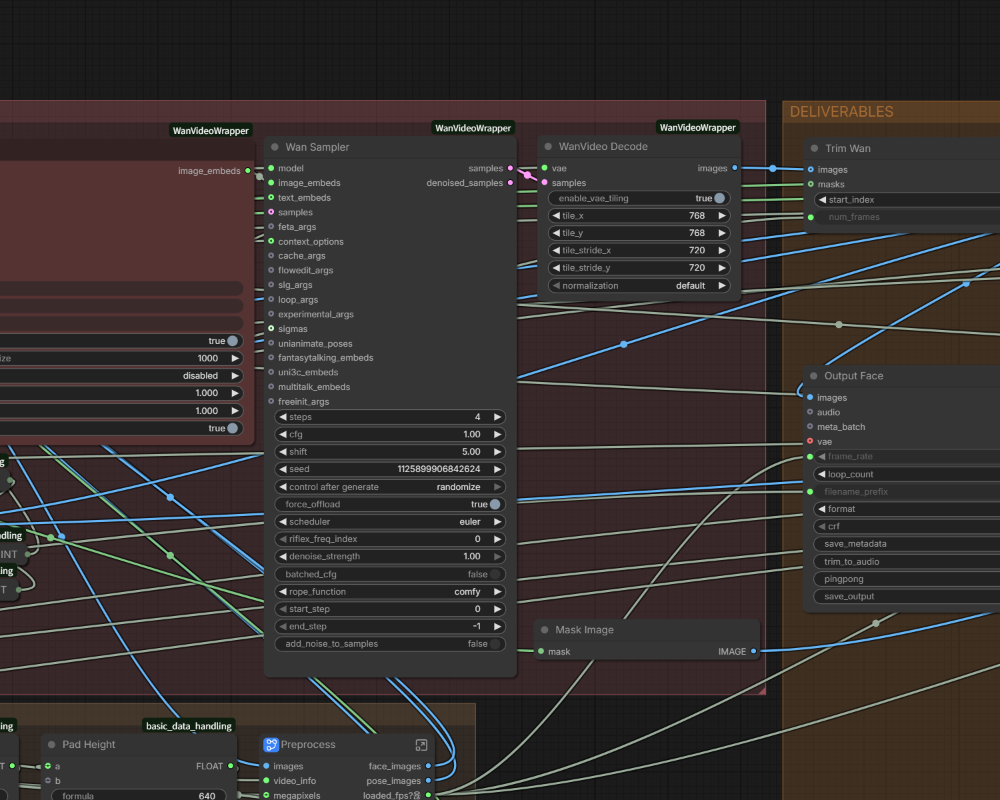
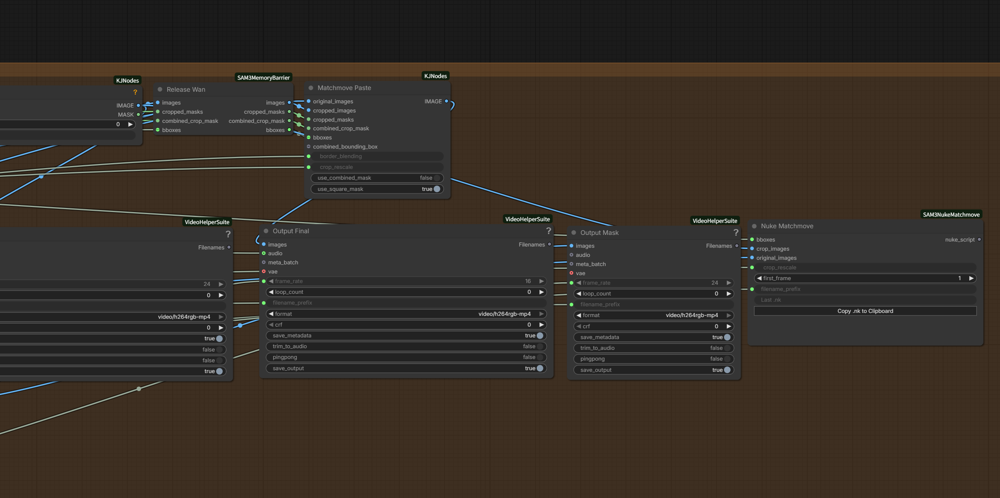
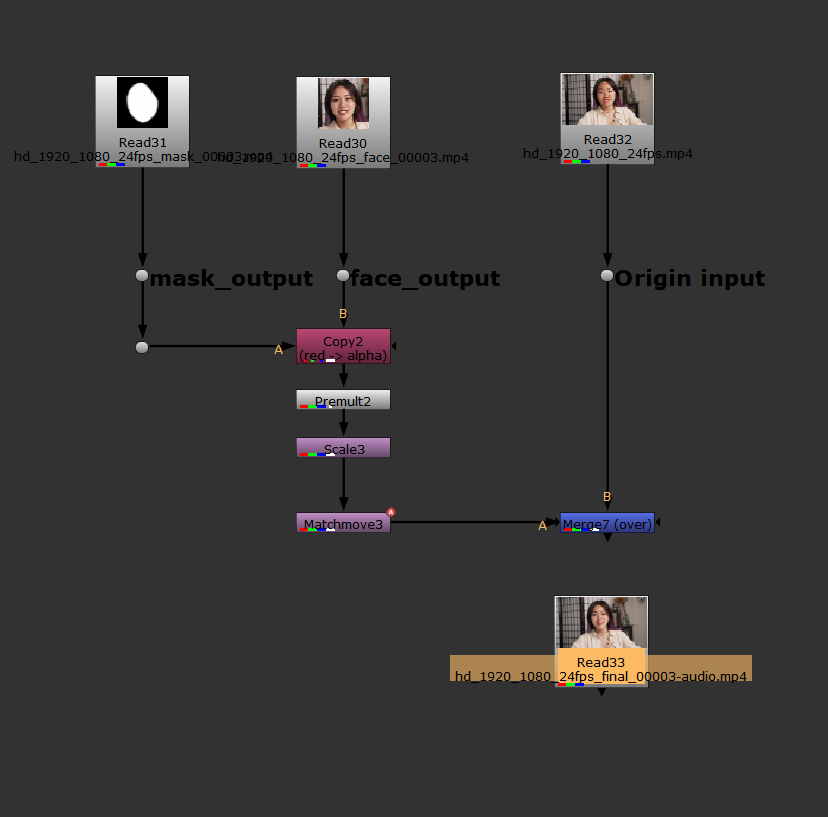

# Wan Animate + SAM3 Head Matchmove for Nuke

[한국어](#한국어) · [English](#english)

## 한국어

ComfyUI에서 **Wan Animate FaceOnly** 결과를 SAM3 헤드 트래킹으로 원본 플레이트 위치에 되돌리고, Nuke에서 바로 오버할 수 있는 정사각형 Face/Mask와 Matchmove `.nk`를 만드는 워크플로우입니다.

## 워크플로우 캡처

글자를 확인할 수 있도록 원본 노드 크기에 가깝게 고해상도로 export한 전체 캡처입니다. 서버에는 이후 같은 형식으로 다시 export할 수 있도록 `Workflow Image Export` 플러그인도 설치돼 있습니다.

### 상세 캡처 / Detail views

**Inputs + global controls**

**SAM3 tracking and stabilized crop**

**Wan Animate**

**Deliverables + Nuke handoff**

### 최종 결과 / Nuke 연결

| Final output | Nuke matchmove graph |
| --- | --- |
|  |  |

### 포함 파일

| 경로 | 내용 |
| --- | --- |
| `workflows/wan-animate-sam3-head-for-nuke.json` | ComfyUI 워크플로우 |
| `assets/hd_1920_1080_24fps.mp4` | 예제 원본 입력 영상 |
| `assets/sample_change_face.png` | FaceOnly 레퍼런스 이미지 |
| `assets/hd_1920_1080_24fps_final.mp4` | 원본 해상도 합성 결과 |
| `assets/hd_1920_1080_24fps_face.mp4` | 정방형 FaceOnly 결과 |
| `assets/hd_1920_1080_24fps_mask.mp4` | 정방형 흑백 SAM3 마스크 |
| `nuke/wan-animate-sam3-head-for-nuke.nk` | Nuke matchmove 템플릿 |

### 사용 순서

1. `assets`의 원본/레퍼런스를 ComfyUI의 `input` 폴더에 넣거나 각 입력 노드에서 업로드합니다. JSON을 ComfyUI에 드래그해서 열고 **Input Video**와 **Load Face**를 선택합니다.
2. `GLOBAL CONTROLS`에서 정방형 작업 해상도, crop margin, tracking smoothing, border blending, SAM3 target text를 조절합니다.
3. Queue를 실행합니다. Wan sampler는 `randomize`라 매 Queue마다 새 seed로 다시 생성됩니다.
4. `final`은 바로 검토용으로, `face`와 `mask`는 Nuke 합성용 소스로 사용합니다.
5. Nuke에서 원본 plate와 FaceOnly 영상을 Read한 뒤, 생성된 `.nk`의 노드를 붙여 넣습니다. Face/Mask 입력을 해당 Dot에 연결하고 Merge의 B에 원본 plate를 연결합니다.

### 색상 / 인코딩

Final, Face, Mask 영상은 `libx264rgb` + `CRF 0`의 H.264 RGB 무손실 설정으로 저장합니다. 일반 H.264의 `yuv420p` 재인코딩에서 생길 수 있는 RGB↔YUV 변환 차이를 줄여, ComfyUI에서 본 FaceOnly와 Nuke 합성 소스의 밝기·색상 차이를 최소화하려는 설정입니다.

그래도 Nuke의 Read colorspace, 뷰어 색관리, 원본 파일의 태그가 다르면 다르게 보일 수 있습니다. 원본과 FaceOnly를 같은 colorspace 규칙으로 읽고, 비교할 때는 Viewer LUT를 끈 상태에서도 확인하세요.

### Wan 프레임 길이: 4n 제약

Wan video latent는 임의의 프레임 길이를 그대로 처리하지 않고 **4n 계열의 유효 길이**로 패딩/디코드합니다. 그래서 입력이 72프레임처럼 경계에 맞지 않을 때 요청 프레임, 디코드 프레임, 최종 트림 프레임이 서로 다르게 보일 수 있습니다.

이 워크플로우는 원본 비디오 메타데이터를 유지하고 최종 길이를 원본에 맞춰 trim하도록 구성했습니다. 다만 Wan 관련 노드의 temporal request/decode 수치는 따로 고정하지 말고, 작업하려는 원본 프레임 길이로 Queue 후 Final과 원본의 마지막 프레임을 꼭 확인하세요. 길이가 다르면 Wan 출력 기준이 아니라 **원본 프레임 수**를 최종 trim 기준으로 잡습니다.

### SAM3 트래킹 안정화

- SAM3 target text는 `woman face` 같은 **한 개체를 가리키는 짧은 문구**를 권장합니다.
- Mask 자체가 흔들려도 crop center가 바로 튀지 않도록 bbox를 smoothing합니다.
- `Crop Margin`은 얼굴보다 약간 넓게, `Tracking Smoothing`은 움직임이 빠를수록 낮게 시작합니다.
- 머리 위의 작은 분리 마스크가 생기면 target을 더 구체적으로 하고, single-object 결과만 쓰는지 확인합니다.

### Nuke matchmove 노드

생성되는 `.nk`는 FaceOnly 정방형 소스를 원본 프레임 좌표로 옮기는 Transform 기반 템플릿입니다.

`Face output → Copy(alpha: Mask) → Premult → Scale → Matchmove → Merge(over Original)`

Mask는 FaceOnly와 같은 정방형 크기입니다. Nuke에서 원본 해상도가 바뀌어도 원본 plate Read의 format을 기준으로 Matchmove 데이터를 사용해야 합니다. 레퍼런스 영상의 색이 뜨면 먼저 Nuke colorspace를 맞춘 뒤 Grade를 추가하세요.

### 참고

- Project: <https://github.com/tardis7732/wan-animate-sam3-head-for-nuke>
- Based on: [Wan Animate - Face Only](https://github.com/sonnybox/yt-files/blob/main/COMFY/workflows/Wan%20Animate%20-%20Face%20Only.json)

---

## English

This ComfyUI workflow returns a **Wan Animate FaceOnly** result to the original plate using SAM3 head tracking, then provides square Face/Mask deliverables and a Nuke matchmove `.nk` for compositing.

## Workflow capture

Full high-resolution workflow capture from the ComfyUI canvas, kept close to the native node scale for legible labels. `Workflow Image Export` is also installed on the server for future exports.

### Final output / Nuke graph

| Final output | Nuke matchmove graph |
| --- | --- |
|  |  |

### Included files

| Path | Description |
| --- | --- |
| `workflows/wan-animate-sam3-head-for-nuke.json` | ComfyUI workflow |
| `assets/hd_1920_1080_24fps.mp4` | Example source video |
| `assets/sample_change_face.png` | FaceOnly reference image |
| `assets/hd_1920_1080_24fps_final.mp4` | Full-resolution composited result |
| `assets/hd_1920_1080_24fps_face.mp4` | Square FaceOnly result |
| `assets/hd_1920_1080_24fps_mask.mp4` | Square black-and-white SAM3 mask |
| `nuke/wan-animate-sam3-head-for-nuke.nk` | Nuke matchmove template |

### Quick start

1. Put the source/reference files from `assets` in ComfyUI's `input` directory, or upload them at the input nodes. Drag the JSON into ComfyUI, then select **Input Video** and **Load Face**.
2. Adjust square resolution, crop margin, tracking smoothing, border blending, and the SAM3 target text in `GLOBAL CONTROLS`.
3. Queue the workflow. The Wan sampler uses `randomize`, so every queue starts a new generation seed.
4. Use `final` for review; use `face` and `mask` as Nuke sources.
5. Read the original plate and FaceOnly video in Nuke, paste the generated `.nk` nodes, connect Face/Mask to their Dot inputs, and connect the plate to the Merge B input.

### Colour and encoding

Final, Face, and Mask videos use lossless H.264 RGB (`libx264rgb`, `CRF 0`). This avoids the usual `yuv420p` RGB/YUV conversion and keeps ComfyUI working RGB values much closer to the Nuke source.

Nuke Read colorspaces, viewer colour management, and the original file tags can still change the appearance. Read the original plate and FaceOnly result under the same colour-management rule, and compare with the Viewer LUT disabled as well.

### Wan frame-length / 4n behaviour

Wan video latents operate on valid **4n-family temporal lengths**, rather than arbitrary frame counts. An input such as 72 frames can therefore produce different request, decode, and final-trim counts.

The workflow keeps the original video metadata and trims the final output to the original duration. Do not hard-code the Wan temporal request/decode values: after queueing a new clip, compare the final frame to the original. When a correction is needed, use the **original clip frame count** as the final trim reference.

### SAM3 stabilization

- Use a short single-subject target, such as `woman face`.
- Bbox smoothing prevents a jittery mask from immediately becoming a jittery crop center.
- Start with a slightly generous `Crop Margin`; lower `Tracking Smoothing` for faster motion.
- If small detached masks appear, make the target more specific and keep only the intended single-object result.

### Nuke matchmove template

The generated `.nk` is a Transform-based template that maps the square FaceOnly source back into original-plate coordinates.

`Face output → Copy(alpha: Mask) → Premult → Scale → Matchmove → Merge(over Original)`

The mask is the same square size as FaceOnly. For clips with a different original resolution, use the original plate Read format as the matchmove reference. If the inserted face appears different in colour, first align Nuke colourspaces, then add a Grade if required.

### Credits

- Project: <https://github.com/tardis7732/wan-animate-sam3-head-for-nuke>
- Based on: [Wan Animate - Face Only](https://github.com/sonnybox/yt-files/blob/main/COMFY/workflows/Wan%20Animate%20-%20Face%20Only.json)
